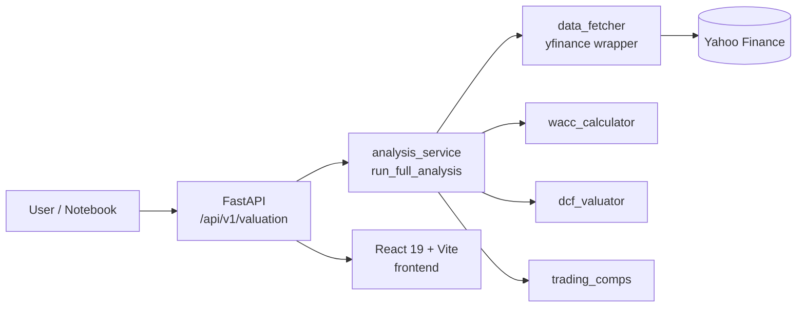

# Company Valuation Dashboard

A full-stack equity-valuation platform that runs a DCF, computes a CAPM-based
WACC, and pulls trading comparables for a chosen ticker in a single API call.
The React dashboard surfaces the cash-flow projection, the WACC waterfall,
peer multiples, and the historical price chart side by side.

Data comes live from Yahoo Finance via `yfinance`. The valuation services
are pure Python and reusable from scripts, notebooks, or the API.

<p>
  
  
  
  
  
  
</p>

> Educational tool. Uses simplified assumptions and depends on the
> availability and accuracy of public Yahoo Finance data. Nothing in this
> repository is investment advice.

---

## Why this project

A DCF on a single name is a homework exercise. A DCF that you can run on any
ticker, side-by-side against trading comps, with the inputs visible and
adjustable, is closer to how a junior analyst actually works. This repo is
that workflow as a small product:

- **DCF** with configurable risk-free rate, equity risk premium, terminal
  growth, projection horizon, and per-year FCF growth rates.
- **WACC** built from market beta (CAPM), cost of debt from the latest
  income statement, and target capital structure from the latest balance
  sheet.
- **Trading comps** over a user-defined peer set with P/E, EV/EBITDA, P/S,
  P/B multiples and statistical context (mean, median, min, max).
- **Reusable services** — the calculators are pure functions, callable from
  the API, from `example_usage.py`, or from a notebook.

---

## Technical highlights

| Area | What's done | Why it matters |
| --- | --- | --- |
| Layered backend | `backend/app/services/` (calculators) → `backend/app/api/routes.py` (FastAPI adapter) → Pydantic schemas. Each calculator is a class with explicit dependencies. | Calculators are unit-testable and importable outside the API. |
| `analysis_service` | One entry point (`run_full_analysis`) composes WACC, DCF, comps, and price history into a single typed result. | The frontend makes one call; integrations and notebooks call the same function. |
| `data_fetcher` | Wraps `yfinance` with explicit field selection and graceful handling of missing income / balance / cashflow rows. | Some tickers return partial data; downstream code sees typed errors instead of `KeyError`. |
| `dcf_valuator` | Pure-Python DCF: per-year FCF projection, Gordon-growth terminal value, present-value sum, per-share intrinsic value. No global state. | Output is reproducible and easy to compare across runs. |
| `trading_comps` | Pulls peer financials, computes P/E, EV/EBITDA, P/S, P/B, and statistical summaries; flags outliers via IQR. | Peer ranges are surfaced, not hidden. |
| `exporter` | Renders the result as a Markdown / text pitch artifact suitable for paste-into-deck. | The API output isn't just JSON — it's also something an analyst can hand someone. |
| Frontend | React 19 + Vite + Tailwind. Tickers entered in a sidebar, results rendered as KPI cards + Recharts visualisations. | Demo-ready out of the box. |

---

## Architecture



```
Company-Valuation-Dashboard/
├── backend/
│   ├── main.py                       FastAPI factory
│   ├── requirements.txt
│   └── app/
│       ├── api/routes.py             HTTP adapters
│       ├── schemas/valuation.py      Pydantic models
│       └── services/
│           ├── analysis_service.py   Orchestrator
│           ├── data_fetcher.py       yfinance wrapper
│           ├── wacc_calculator.py    CAPM-based WACC
│           ├── dcf_valuator.py       Pure-Python DCF
│           ├── trading_comps.py      Multiples + stats
│           ├── exporter.py           Markdown export
│           └── visualizer.py         chart-ready payloads
├── frontend/
│   ├── src/
│   │   ├── App.tsx
│   │   ├── components/
│   │   ├── main.tsx
│   │   └── index.css
│   ├── package.json
│   └── vite.config.ts
├── example_usage.py                  Direct-service example
├── requirements.txt
├── DOCUMENTATION.md
├── SETUP.md
└── QUICKSTART.md
```

---

## Local setup

```bash
# 1. Backend
python3 -m venv .venv && source .venv/bin/activate
pip install -r requirements.txt
uvicorn backend.main:app --reload --port 8000

# 2. Frontend (separate terminal)
cd frontend
cp .env.example .env                # NEXT_PUBLIC_API_BASE defaults to localhost:8000
npm install
npm run dev                         # http://localhost:5173
```

| Service       | URL                              |
| ------------- | -------------------------------- |
| Frontend      | http://localhost:5173            |
| Backend       | http://localhost:8000            |
| API docs      | http://localhost:8000/docs       |

See [`SETUP.md`](SETUP.md) and [`QUICKSTART.md`](QUICKSTART.md) for more
detail, and [`DOCUMENTATION.md`](DOCUMENTATION.md) for the service-level
reference.

---

## API overview

```http
GET  /health
GET  /api/v1/health
POST /api/v1/valuation
```

Sample request:

```json
{
  "ticker": "AAPL",
  "risk_free_rate": 0.04,
  "market_risk_premium": 0.06,
  "terminal_growth_rate": 0.03,
  "projection_years": 5,
  "growth_rates": [0.10, 0.08, 0.06, 0.05, 0.04],
  "peer_tickers": ["MSFT", "GOOGL", "AMZN"]
}
```

Response carries:

- company metadata
- WACC breakdown (cost of equity, cost of debt, weights)
- DCF outputs (projected FCFs, PVs, terminal value, intrinsic value per share)
- trading-comp multiples + statistics
- price-history series for the frontend chart

---

## Use the services directly

```python
from backend.app.services.analysis_service import run_full_analysis

result = run_full_analysis(
    ticker="AAPL",
    risk_free_rate=0.04,
    market_risk_premium=0.06,
    terminal_growth_rate=0.03,
    projection_years=5,
    growth_rates=[0.10, 0.08, 0.06, 0.05, 0.04],
    peer_tickers=["MSFT", "GOOGL", "AMZN"],
)

print(result["dcf"]["fair_value_share_price"])
```

See [`example_usage.py`](example_usage.py) for a fuller walk-through.

---

## Limitations

- **Single-stage DCF.** No multi-stage or sector-specific adjustments.
- **No caching.** Every request hits `yfinance` and is subject to upstream
  rate limits.
- **No auth.** Single-tenant local tool.
- **Yahoo Finance field coverage varies** by ticker; the data fetcher
  rejects incomplete data with a typed error rather than guessing.

---

## Future work

- Sensitivity / scenario endpoints (tornado on key inputs)
- Historical valuation tracking with a small SQLite cache
- Monte Carlo simulation over FCF growth and WACC
- Authenticated workspaces with saved studies

---

## License

MIT — see [`LICENSE`](LICENSE). Built in 2025 as a portfolio project.
